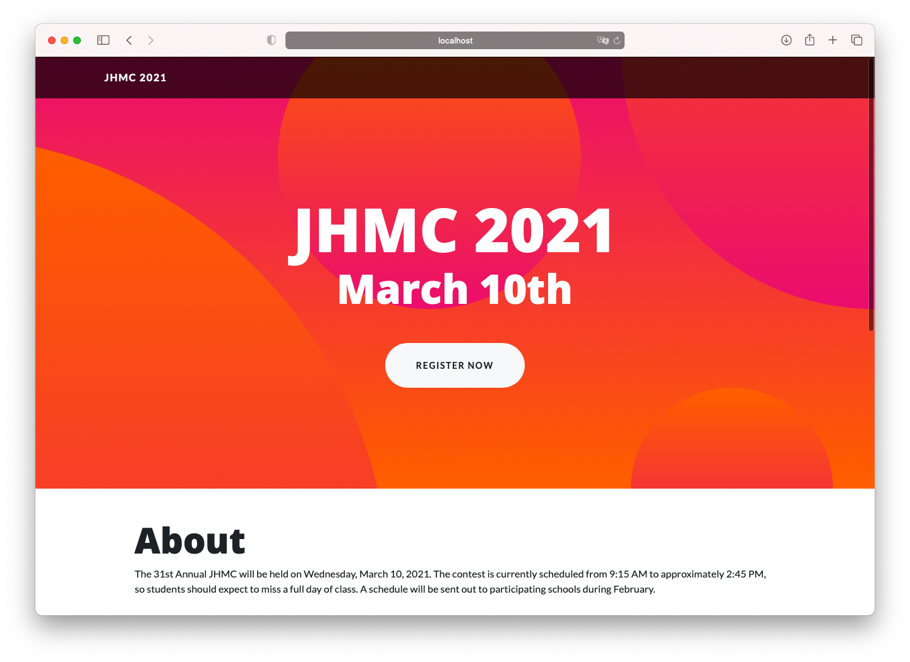
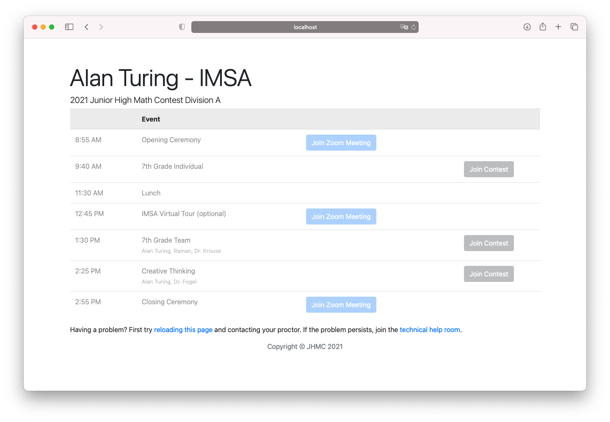
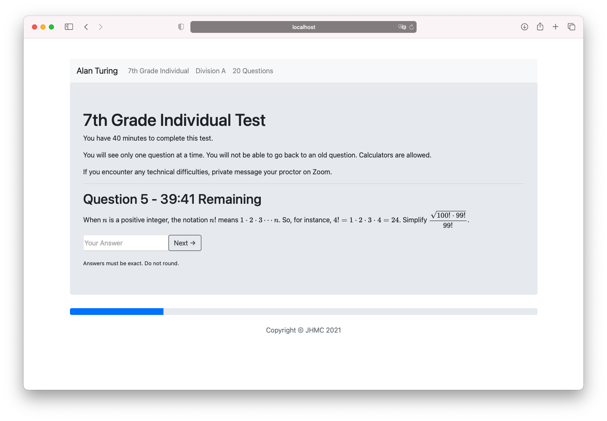

# Junior High Math Contest Website

## Purpose
JHMC has been an in person competition hosting over 450 middle schoolers from around the state of Illinois for 34 years. After COVID struck the US, we had to move the competition to a virtual format. There was really no available way to have hundreds of middle school students take a math competition at the same time. Most other math competitions that hadn't previously been virtual had cancelled the contest due to virtual competition difficulties.

Because we didn't want to cancel JHMC this year, we decided to make a test-taking site for JHMC. At first, it was just a small form allowing students to input answers, with the problems displayed above it. It evolved to much more. Each student had their own schedule page, which gave them a Zoom link and the link for them to take their test. It also included websocket alerts — so we could instantly notify every contest participant about a change of schedule or any other information. It was a central figure for the contest. While the website isn't served anymore due to costs, you can always run it with `nodemon index.js`.

There is also a tool that inputs roster data into a spreadsheet, an auto-grader for the tests, and a tool that generates schedule links for all the students, all in `./one-time-scripts`.

## Items
* Front-end test taking website `./views`
* Home page `./public`
* Back-end of the test taking website `./index.js, ./schedule.js, ./socket.js, ./tests.js`
* Auto-load data into Airtable `./one-time-scripts/load-students.js`
* Create & initialize student tests `./one-time-scripts/initialize-tests.js`
* Generate links of student pages to give to teachers `./one-time-scripts/schedule-links.js`
* Autograde tests, generate test reports (should only be used to mark answers right) `./one-time-scripts/grading`
* Information distributed coaches, sample score reports `./docs`

## Technologies Used
* Airtable
* Websockets
* Node.JS
* Express
* Google Cloud
* Git/GitHub
* TypeScript
* Markdown
* MathJAX
* LaTeX
* Bootstrap

## Screenshots
See the [logistics powerpoint](https://github.com/thewindsofwinter/JHMC-scripts/blob/master/docs/JHMC%20Information%20Session.pdf) and the [sample score report](https://github.com/thewindsofwinter/JHMC-scripts/blob/master/docs/Sample%20Score%20Report.pdf) for more.

The contest homepage

A sample student schedule. These were dynamically generated for 300 students.

A sample testing page. The answers sync to Airtable.

An alert pushed to the client using Websockets. 

